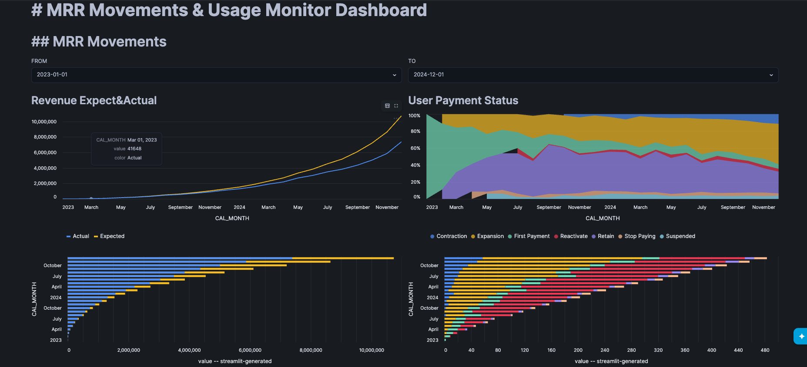

# Enterprise SaaS Revenue Leakage Audit & Financial Analytics Platform

---

## 📈 Business Case & Analytical Problem Statement
SaaS company generally has 2 problems in data usage.

1. Dealing with mismatched data between data from system and data from actual usage.  
    example. 
    * Services continue to be used after contract has expired  
    * Users continue to use the premium features after downgrading their plans
2. Monitoring the credit costs in Snowflake

In this project, I implemented 2 mart tables to analyze the Monthly Recurring Revenue(MRR) and to monitor User's incorrecct usage with dbt and Snowflake. 

Additionaly, Streamlit dashboard is implemented to analyze the data made here and it can monitor how much credit is used cost from the dashboard.

Environment : 
* Python : 3.12.0
* dbt : 1.11.11
* Snowflake 
* Streamlit
* Github Actions

---

## 📊 Dashboard Sneak Peek
#### Monthly Recursive Revenue(MRR) Movements
  

#### Usage Logs
※ Specify the date range first and click Submit to show the graph

  

  

#### Query Credit Cost
※Estimated Credit from the `information_schema.query_history`

  